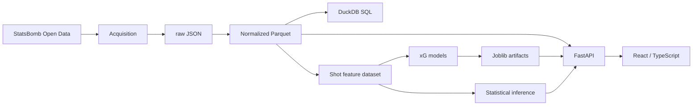

# Football Intelligence Lab

End-to-end football analytics on [StatsBomb Open Data](https://github.com/statsbomb/open-data): reproducible ingestion, Parquet/DuckDB storage, statistical inference, probabilistic expected-goals (xG) models, a FastAPI service over processed tables and persisted artifacts, and a React/TypeScript UI. Research lives in notebooks; reusable logic lives in `src/football_intelligence/`.

## Why this project exists

Football data is clustered (shots in players, players in matches), imbalanced (~10% of in-play shots are goals), and easy to leak (post-shot fields, another vendor's xG). This repository is a small application for exploring how classical statistics, machine learning, probabilistic modelling and production engineering should behave under those constraints — not a notebook dump and not a claim that every technique on the long-term roadmap is already here.

## Architecture



The API **loads** processed Parquet and fitted artifacts. It does not train on startup.

## Data

Source: [StatsBomb Open Data](https://github.com/statsbomb/open-data), mirrored byte-for-byte under `data/raw/statsbomb/`. Raw files are never edited in place and are **not** committed.

Default development subset (`make data`): two men's international tournaments.

| Competition    | Season | Matches | Shots (incl. shootouts) | Goals |
| -------------- | ------ | ------: | ----------------------: | ----: |
| FIFA World Cup | 2018   |      64 |                   1,706 |   183 |
| UEFA Euro      | 2020   |      51 |                   1,289 |   155 |
| **Total**      |        | **115** |               **2,995** | **338** |

That is on the order of 350 MB of JSON, 1,199 squad-listed players, and a few percent of the full open-data repository. A tournament gives each player at most ~7 matches, so per-player finishing estimates are noisy (median **3 shots per shooter** among 651 players with at least one in-play shot).

`make process` writes Parquet under `data/processed/` (~15 MB). DuckDB reads those files in memory; there is no server database.

| Table     | Grain |
| --------- | ----- |
| `matches` | One match, including coordinate-fidelity flags |
| `events`  | One event, common attributes only |
| `shots`   | One shot, payload flattened; `is_shootout` marks period 5 |
| `players` | One player, with squad-listing counts |

`make features` builds `data/processed/shot_dataset.parquet`: **2,918** in-play shots, **288** goals, **9.87%** prevalence. Period-5 penalty shootouts are excluded there because they are a different data-generating process (~65% conversion) and are not part of the match score. Analytical DuckDB queries exclude shootouts by default as well.

`statsbomb_xg` is retained as a **benchmark** (another model's estimate of the same target) and is refused as a training feature in code.

World Cup locations in this extract are integer yards; Euro locations are sub-yard. That difference is confounded with competition.

```bash
make data
make data-list
make data DATA_ARGS="--competition-season 11/27"
make process
make features
```

Downloads are idempotent (ETag revalidation; per-match files skipped once present). Data is provided by StatsBomb under the StatsBomb Open Data User Agreement; attribution is required for published work derived from it.

## Football geometry and feature engineering

StatsBomb pitch: **120 × 80**, attacked goal at **x = 120**, posts at **(120, 36)** and **(120, 44)**, centre **(120, 40)**. One coordinate unit is one yard (in-play penalties sit ~12 yards from the goal line). Attacking direction is already normalised toward x = 120 in every period; coordinates must not be flipped by half.

- `shot_distance` — Euclidean yards to the goal centre.
- `shot_angle` — radians subtended at the shot by the two posts (true goal-mouth angle, not a proxy).

Context available before the strike (body part, shot type, technique, under pressure, first time) is used by the contextual models. Post-shot fields (`end_*`, `outcome`) and `statsbomb_xg` are forbidden features.

## Statistical inference

Implemented in `src/football_intelligence/statistics/` and exercised on the real extract in `02_statistical_inference.ipynb`. Methods include:

- two-sample: Student t, **Welch t** (preferred when equal variance is not assumed), Mann–Whitney U, Kolmogorov–Smirnov
- paired: paired t, Wilcoxon signed-rank
- multi-group: one-way ANOVA, Welch ANOVA, Kruskal–Wallis
- contingency: chi-square, Fisher exact
- diagnostics: numeric summaries, IQR/outlier flags, Shapiro–Wilk (with the large-n caveat)
- uncertainty: bootstrap and **cluster bootstrap** (match or player as the resampling unit)
- permutation and **clustered permutation**
- multiple testing: Bonferroni (FWER), Benjamini–Hochberg FDR
- effect sizes: mean difference, Cohen's d, Hedges' g, probability of superiority, rank-biserial, odds ratio, risk difference, Cramér's V

**Methodological rule:** the unit of analysis and the dependence structure matter more than switching tests off a normality p-value. Shots are repeated measures within players and matches; treating 2,918 rows as iid understates uncertainty. Mann–Whitney is documented as a test of stochastic ordering, not “a median test”. Statistical significance is never treated as practical importance.

CLI demos: `make diagnostics`, `make comparisons`, `make bootstrap`, `make permutation`.

## xG modeling

Target: \(P(\text{goal} \mid \text{shot features})\). This is probability estimation, not classification. Accuracy is omitted on purpose: a constant “no goal” rule is ~90% accurate and useless as xG.

Shared preprocessing (`models/preprocessing.py`) standardises numerics, one-hot encodes categoricals, and rejects leaky columns so every family sees the same problem.

| Family | Module | Role |
| ------ | ------ | ---- |
| Logistic regression | `models/logistic.py` | Interpretable baseline (distance + angle) and a contextual variant |
| XGBoost | `models/xgboost.py` | Gradient boosting, early stopping |
| LightGBM | `models/lightgbm.py` | Histogram boosting |
| CatBoost | `models/catboost.py` | Ordered boosting / categorical handling |

Metrics (proper scoring + ranking): ROC-AUC, PR-AUC, log loss, Brier score, skill scores vs the base-rate predictor, and **calibration-in-the-large** (mean prediction − observed prevalence).

Hold-out comparison from the executed `03_xg_models.ipynb` (one **group-by-match** split, same test shots for every row). StatsBomb xG is a reference only — it is not a model trained in this repo.

| Model | ROC-AUC | PR-AUC | Log loss | Brier |
| ----- | ------: | -----: | -------: | ----: |
| Base rate | 0.500 | 0.101 | 0.326 | 0.090 |
| Logistic (distance + angle) | 0.742 | 0.275 | 0.290 | 0.083 |
| Logistic + context | 0.757 | 0.300 | 0.285 | 0.081 |
| XGBoost + context | 0.734 | 0.268 | 0.290 | 0.082 |
| LightGBM + context | 0.736 | 0.268 | 0.293 | 0.083 |
| CatBoost + context | 0.755 | 0.296 | 0.293 | 0.084 |
| StatsBomb xG (reference) | 0.784 | 0.400 | 0.269 | 0.076 |

On this extract the contextual logistic is the strongest *in-repo* model on log loss and Brier; trees do not automatically win a small, low-cardinality tabular problem. The vendor xG uses information this project does not.

**Served artifacts** (what FastAPI loads today) are `logistic_baseline` and `logistic_contextual` under `artifacts/shot_goal_probability/`. Boosting libraries are implemented and tested; their fitted files are not currently persisted for the API.

## Validation and leakage

- Train/test split is **group-by-match** (`evaluation/validation.py`). No `match_id` may appear on both sides; `assert_no_group_leakage` enforces that.
- Event-level random splits leak: shots from the same match share teams, state, pitch and referee, so test error looks too good.
- `statsbomb_xg`, `goal`/`outcome`, and post-shot coordinates cannot be features (`reject_leaky_features`).
- Shootouts are dropped from the modelling table.
- Temporal / player-grouped / cross-validated strategy comparison is **not** implemented yet.

## Probability calibration

xG is only useful if 0.15 means “about 15% of similar shots score”. The metric suite includes calibration-in-the-large. Reliability diagrams, ECE, and post-hoc scaling (Platt / isotonic) are **not** a dedicated module yet — see Roadmap.

## Bayesian / PyMC

`notebooks/04_bayesian_pymc_tiny_example.ipynb` is an **educational** notebook (PyMC + ArviZ), not a production hierarchical finishing service.

It covers conjugate Beta–Binomial A/B (analytical posterior, Monte Carlo from Beta, \(P(p_B>p_A)\), lift interval), why MCMC is needed once the model is a logit + player effects, a **small** hierarchical Bernoulli logistic on 176 real open-play shots / 12 players, NUTS diagnostics (R-hat, ESS, divergences, trace plots), prior/posterior predictive checks, and partial pooling / shrinkage. There is no `models/bayesian.py` and the API does not serve PyMC posteriors.

## Notebooks

| Notebook | Purpose |
| -------- | ------- |
| `01_data_exploration.ipynb` | Entities, class balance, coordinate conventions, clustering, missingness, leakage traps. No modelling. |
| `02_statistical_inference.ipynb` | Real-data inference through the statistics package: tests, effect sizes, bootstrap/permutation units, multiple testing. |
| `03_xg_models.ipynb` | Logistic baseline vs XGBoost / LightGBM / CatBoost, group-by-match evaluation, comparison with StatsBomb xG. |
| `04_bayesian_pymc_tiny_example.ipynb` | Bayesian cheat-sheet: conjugate A/B, tiny hierarchical PyMC demo, MCMC diagnostics. |

```bash
make notebook   # JupyterLab
```

## Application / API

FastAPI (`football_intelligence.api.app:app`) on **http://127.0.0.1:8000**. Paths: `FOOTBALL_PROCESSED_ROOT` (default `data/processed`), `FOOTBALL_ARTIFACTS_ROOT` (default `artifacts`), optional `FOOTBALL_CORS_ORIGINS`.

| Method | Path | Role |
| ------ | ---- | ---- |
| GET | `/health` | Liveness |
| GET | `/api/summary` | Match / player / shot / goal counts |
| GET | `/api/models` | Persisted artifact metrics |
| POST | `/api/predict/shot` | xG for a location (+ optional context) |
| GET | `/api/statistics/summary` | Distance/angle summaries and a few precomputed tests |
| GET | `/api/matches` | Paginated match list (`limit`, `offset`) |
| GET | `/api/matches/{match_id}/shots` | Shot map payload, optional `model=` |

Distance and angle are **derived from `x`,`y`** in the predict payload; they cannot be supplied independently.

```bash
make api

curl -s http://127.0.0.1:8000/health
curl -s http://127.0.0.1:8000/api/summary
curl -s "http://127.0.0.1:8000/api/matches?limit=1"
curl -s -X POST http://127.0.0.1:8000/api/predict/shot \
  -H "Content-Type: application/json" \
  -d '{"x":108,"y":40,"body_part":"Right Foot","shot_type":"Open Play"}'
```

Missing Parquet or artifacts yield **503**, not silent retraining.

## Frontend

React 19 + TypeScript + Vite 8 (`frontend/`). Pages, all live against the API:

| Route | Page |
| ----- | ---- |
| `/` | Overview — dataset KPIs and loaded models |
| `/models` | Model comparison (metrics from artifacts) |
| `/matches` | Match explorer, pitch shot map, predicted xG |
| `/predict` | Click/adjust a shot location and score a model |
| `/statistics` | Shot-distance/angle summaries and API findings |

Local dev uses the Vite proxy (`/api`, `/health` → `http://127.0.0.1:8000`). Leave `VITE_API_BASE` empty so the browser stays same-origin.

```bash
make api        # terminal 1
make frontend   # terminal 2 — http://localhost:5173
```

## Docker

`compose.yaml` defines **backend** (Python 3.12, uv, uvicorn **:8000**) and **frontend** (Vite preview **:5173**). Host `data/processed/` and `artifacts/` are bind-mounted read-only. Healthchecks are defined; the frontend waits until the backend is healthy.

```bash
docker compose up --build
# or
make docker-up
make docker-down
```

Requires existing processed tables and artifacts on the host. Optional overrides: `.env.example`.

## Project structure

```text
football-intelligence-lab/
├── src/football_intelligence/
│   ├── data/            # StatsBomb acquisition, Parquet, DuckDB
│   ├── features/        # shot geometry and modelling table
│   ├── statistics/      # tests, diagnostics, bootstrap, permutation
│   ├── models/          # logistic, XGBoost, LightGBM, CatBoost, artifacts
│   ├── evaluation/      # probability metrics, group split
│   └── api/             # FastAPI
├── tests/               # pytest + offline StatsBomb fixtures
├── notebooks/
├── frontend/            # React / TypeScript UI
├── data/                # raw / interim / processed (gitignored payloads)
├── artifacts/           # fitted models (gitignored binaries)
├── Dockerfile           # API image
├── compose.yaml
├── Makefile
└── pyproject.toml
```

## Quick start

```bash
git clone https://github.com/GingerSnapsLOL/football-intelligence-lab.git
cd football-intelligence-lab

make install          # uv sync + pre-commit
make data             # StatsBomb development subset
make process          # Parquet tables
make features         # shot modelling dataset
make check            # ruff + mypy + pytest

make notebook         # JupyterLab
make api              # http://127.0.0.1:8000  (needs artifacts/)
make frontend         # http://localhost:5173
```

Python **≥ 3.12** and [uv](https://docs.astral.sh/uv/). Docker demo: `docker compose up --build` after the data/artifact steps.

## Development

| Tool | Role |
| ---- | ---- |
| uv | Environment and lockfile (`pyproject.toml`, `uv.lock`) |
| ruff | Lint + format |
| mypy | Strict typing on `src/` and `tests/` |
| pytest + pytest-cov | Tests |
| pre-commit | Hooks (ruff, conflict/private-key checks) |
| Makefile | Common commands |

`make check` = `ruff format --check` + `ruff check` + `mypy` + `pytest`.

Other targets: `format`, `lint`, `typecheck`, `test`, `data`, `data-list`, `process`, `queries`, `features`, `diagnostics`, `comparisons`, `bootstrap`, `permutation`, `api`, `frontend`, `docker-up`, `docker-down`.

The Makefile also has `train` (`python -m football_intelligence.models.logistic`). That module currently has **no CLI** and does not write artifacts; do not rely on it to populate `artifacts/`.

## Testing

Tests run **offline** on checked-in StatsBomb JSON fixtures plus synthetic samples. They cover, among other things:

- StatsBomb path layout, competition/season parsing, acquisition helpers
- Parquet normalisation (`is_shootout`, schemas) and DuckDB queries
- shot distance/angle geometry, pitch bounds, shootout exclusion from the modelling table
- statistical procedures checked against SciPy/statsmodels on synthetic data with known properties
- effect sizes, Bonferroni / Benjamini–Hochberg
- row vs cluster bootstrap and permutation (match/player units)
- leaky-feature rejection, group-by-match split with no shared `match_id`, probability metrics vs sklearn
- XGBoost / LightGBM / CatBoost builders (identifier leakage rules, early stopping)
- FastAPI health, summary, predict, matches, and 503-on-missing-data behaviour

```bash
make test
```

The current run of that suite collects and passes **487** tests. Coverage is measured on `src/football_intelligence/` but is not treated as a headline KPI.

## Statistical/ML design decisions

- Welch t is the default two-sample mean comparison when equal variance is not assumed.
- Mann–Whitney is not described as a test of medians.
- Clustering (player, match) is first-class in bootstrap/permutation and in validation.
- xG is scored with proper scoring rules and ranking metrics, not accuracy.
- p-values are reported with effect sizes, sample sizes, and limitations; “not significant” is not “no effect”.
- StatsBomb xG is a benchmark, never a covariate.
- Partial pooling is motivated by wildly unequal shot counts; the PyMC notebook demonstrates shrinkage, it does not replace the logistic API.

## Limitations

- Development data is two men's tournaments: not league football, not women's football, not a full career panel.
- Median three shots per player: raw conversion rates are extremely noisy.
- Coordinate precision differs by competition.
- No tracking / SkillCorner data.
- No causal claims from xG coefficients, SHAP-style values, or player effects.
- Bayesian work is a small notebook, not a production hierarchical finishing model.
- API currently serves logistic artifacts only.
- Boosting vs logistic comparison is a single grouped hold-out, not nested cross-validation.
- No dedicated calibration-curve / reliability module yet.

## Roadmap

Future work, **not implemented** in this repository today:

- Production hierarchical player-finishing model (PyMC module + API)
- GAM xG
- SHAP, PDP/ICE, constrained counterfactuals
- Reliability diagrams and optional probability recalibration
- Temporal and player-grouped validation strategies
- SkillCorner tracking, spatial features, pitch control
- Sequential / graph / RL experiments
- Automatic statistical-test recommender (decision support only)

## Reproducibility and data attribution

Randomised splits, bootstrap, permutation and model fits take explicit seeds where the library owns the RNG. External StatsBomb JSON and generated Parquet/joblib files are gitignored; obtain data with `make data` and rebuild with `make process` / `make features`. Model binaries under `artifacts/` are local run products.

Data is provided by StatsBomb under the StatsBomb Open Data User Agreement. Attribution is required when results derived from it are published.

Project licensing is not yet specified.
